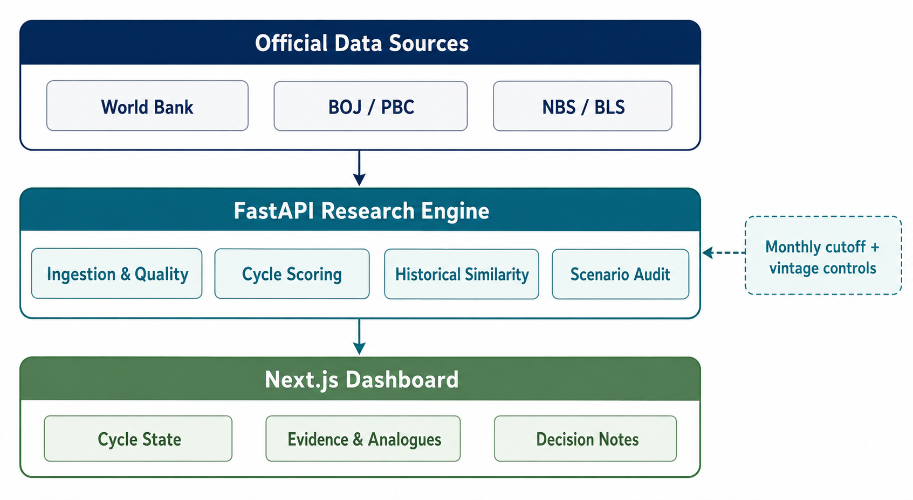

# 长期环境决策看板

> Recommended repository name: `long-horizon-decision-dashboard`

一个面向职业与技能选择的宏观环境研究工具，把周期状态、情景概率、历史相似期和中美日结构性证据放在同一块看板中，帮助用户形成可复盘的决策记录。

本项目是研究与决策辅助工具，不是投资建议，也不承诺准确预测未来；相似期仅作参考。

## Architecture

The dashboard follows a simple flow: official public data is ingested and quality-checked by the FastAPI research engine, transformed into cycle scores and historical analogues, then presented in the Next.js interface with auditable scenario notes.

